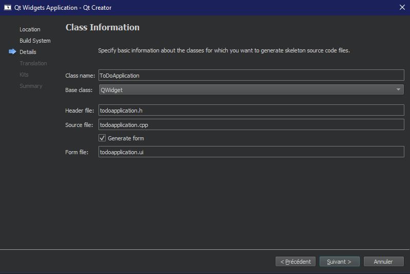
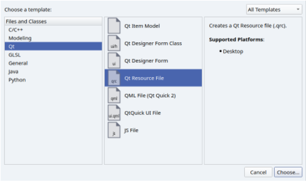
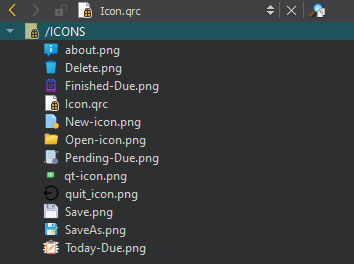
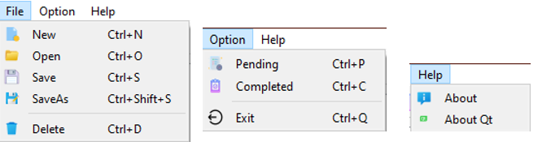
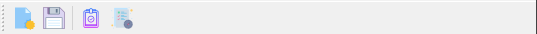
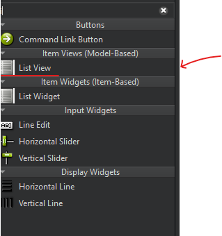
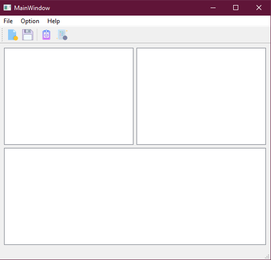
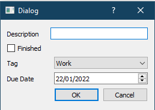

# ToDoApplication
<!-- Logo -->
<p>
  <p align=left>
     
    
  </p>
 </p>
 
 [ToDo Application using containers.](https://anassbelcaid.github.io/CS311/todoapp/"CS311,anass.belcaid")
 
 <!-- TABLE OF CONTENTS -->

<details>
  <summary>Table of Contents</summary>
  <ol>
    <li>
      <a href="#Generality of the Project">Generality of the Project</a>
      </li>
        <li><a href="#Introduction">Introduction</a></li>
        <li><a href="#Subclassing QMainWindow">Subclassing QMainWindow</a></li>
        <li><a href="#QResources Management systems">QResources Management systems</a></li>
        <li><a href="#Creation of the interface">Creation of the interface</a></li>
        <li><a href="#Defining a Task">Defining a Task</a></li>
        <li><a href="#Funcionnality">Item Based Model</a></li>
           <ul>
              <li><a href="#close the application">close the application</a></li>
              <li><a href="# New Task :"> New Task :</a></li>
              <li><a href="# The View of the main widget should be split in three areas:"> The View of the main widget should be split in three areas:</a></li>
           </ul>
        <li><a href="#SQL :"> SQL :</a></li>
        <li><a href="#Conclusion">Conclusion</a></li> 
    
              
  </ol>
</details>

<!-- Introduction -->

## Introduction :

>The goal of the homework is to create an application to manage you tasks. It should have all the features of main application such as menues, actions and toolbar. The application must store an archive of all the pending and finished tasks.

## Subclassing QMainWindow :

So our, first setp is to create a Qt project (Yes now we are ready!). and choose the following steps:

  1. Qt Widgets Application.
  2. Name the project ToDoApplication.
  3. Choose qmake as configuration tool.
  4. Name the class ToDoApplication.
  
  <p align="center">
     
 </p>
    
  5. check the form. as we will be creating a Main Functional application.
  6. Finish the creation by selecting all the default remaining options.
  
## QResources Management systems :

>The Qt resource Management system is a platform independent mechanism for storing binary files in the application’s executable. The is useful if you’re application always needs a certain set of files such as:

    • icons.
    • translations files.
    • local database.
    
The Qt mechanism system is based on tight cooperation between qmake and rcc (Qt resource compiler).

  1. Go to your project and click add File
  2. Select Qt Resource File as shown in the figure:
  
  
 <p align="center">
     
 </p>
    
  3 You’ll see a third section in your project called resources.
  4. Select the icons.qrc file and select Add existing files
  5. Select all the pictures, you want to add.
  
 <p align="center">
     
 </p>

## Creation of the interface :

> So in this part we will create the interface of this Application with the GUI .

  1.The Menu :
  
  <p align="center">
     
 </p>

  2.The ToolBar :
  
  <p align="center">
     
  </p>
  
  3.QlistView :

  <p align="center">
     
  </p>
  
  > So , finally the result of this application is bellow :
  
  <p align="center">
     
  </p>
  
```diff
- To conclude this part of the App , we can say that if you follow this steps you will be able to complete a graphical application (without functionality).

```
## Defining a Task:
 - A Task is defined by the following attributes:

 - A description: stating the text and goal for the task like (Buying the milk).

 - A finished boolean indicating if the task is Finished or due.
 - A Tag category to show the class of the task which is reduced to the following values:

    - Work
    - Life
    - Other
 - Finally, a task should have a DueDate which stores the Date planned for the date.
 > So , finally the result of the Task  :
 
 <p align="center">
     
  </p>
  
  ## Functionnality :
   ### close the application :
   
   ```cpp
void Todo::closeEvent(QCloseEvent *e){
    if (QMessageBox::question(this, tr("Close"), tr("Do you want to close this Window?"), QMessageBox::No, QMessageBox::Yes) == QMessageBox::No) {

            return;
        }

    QFile file("C:/Users/adilr/Desktop/New folder/save.txt");
    if (file.open(QIODevice::ReadWrite| QIODevice::Text)){

        QTextStream out(&file);
        for (int i=0;i<ui->listWidget->count() ;i++ ) {
            out<< "1"<< ui->listWidget->item(i)->text() << Qt::endl;
        }
        for (int i=0;i<ui->listWidget_2->count() ;i++ ) {
            out<< "2"<< ui->listWidget->item(i)->text() << Qt::endl;
        }
        for (int i=0;i<ui->listWidget_3->count() ;i++ ) {
            out<< "3"<< ui->listWidget->item(i)->text() << Qt::endl;
        }
        file.close();
    }

}
   ```
   
   ```cpp
   void Todo::on_actionClose_triggered()
{
    auto reply = QMessageBox::question(this, "Exit",
                                    "Do you really want to quit?");

    if(reply == QMessageBox::Yes)
        qApp->exit();
}
```
>• To see the result, we will have it displayed in the main class:

https://user-images.githubusercontent.com/86802864/150692249-cabe84f1-b6d1-45e7-a62d-432e95b04f2a.mp4


 ### New Task :
- Inherited function:

 ```cpp
 void Todo::tasks(){

    task D;
     //Executing the dialog and storing the user response


     auto repl = D.exec();

     //icons of tasks
     QIcon taskIcon(":/task.png");
     QIcon pendIcon(":/pend.png");
     QIcon finiIcon(":/fini.png");


     int DW=D.getDate().dayOfWeek();//to get tha name of the day from the date
     int DM=D.getDate().dayOfYear();//to get tha name of the month from the date
     QString Yearmonth = QDate::longMonthName(DM);//transfor day to string
     QString weekDay = QDate::longMonthName(DW);//transform the mont to string

     if(repl == task::Accepted)
     {
        auto text = D.getDescription();
        //test if the user valid the checkbox or no if he checked then the task finished else is'nt finished
        if(D.check()){

            text="Finished :" + D.getDescription() + "  Due: "+ weekDay+" "+Yearmonth+D.date()+" "+"\t Tag: "+D.getTag();
//             ui->listWidget_3->addItem(new QListWidgetItem(finiIcon,text));//for show the information of task  with the icon

            ui->listWidget_3->addItem(text);
     }else{

        if((D.getDate()<=QDate::currentDate())){
            text="Task for today:" + D.getDescription() + "Due: " +weekDay+" "+Yearmonth+D.date()+" "+" \t Tag: "+D.getTag();
           ui->listWidget->addItem(new QListWidgetItem(taskIcon,text));
        }else{
            text="Pending :" + D.getDescription() + "Due: " +weekDay+" "+Yearmonth+D.date()+" "+" \t Tag: "+D.getTag();
            ui->listWidget_2->addItem(new QListWidgetItem(pendIcon,text));
        }


}
        //variable for get the data or the information
        QString a,b,c,d;
        a = D.getDescription();
        b = D.getTag();
        c = D.date();
        d =D.check();
    //test for check if the data base in or no
        if(!connOpen()){
            qDebug() <<"Failed to open the database";
            return;
        }
        connOpen();   // open the database function
        QSqlQuery qry;
        //command for inserte the information to database
        qry.prepare("insert into task (Description,finished,Tag) values ('"+a+"','"+b+"','"+c+"')" );
        qDebug()<<qry.executedQuery();
        //status of save the data
        if(qry.exec()) {
            QMessageBox::information(this,tr("Save"),tr("task Data Saved!"));
            ;
        }else{
            QMessageBox::critical(this,tr("Error"),qry.lastError().text());
        }


 }
}
 
 ```
 
 >• To see the result, we will have it displayed in the main class:


https://user-images.githubusercontent.com/86802864/150693378-bc13ef6c-72f5-42be-b7a2-a062c8dbfd96.mp4


### The View of the main widget should be split in three areas:

  - The first (en persistent) area shows the list of today tasks.
  
```cpp
void Todo::on_actionToday_triggered()
{

    if(ui->listWidget->isVisible()){
        ui->listWidget->setVisible(0);
    }else{
        ui->listWidget->setVisible(1);
}
}
```
>• To see the result, we will have it displayed in the main class:


https://user-images.githubusercontent.com/86802864/150693376-2918b9be-6c2c-4af9-8473-56836d5d6a72.mp4


  - The second one is reserved for pending task (tasks for the future).

```cpp

void Todo::on_actionpending_triggered()
{
    if(ui->listWidget_2->isVisible()){
        ui->listWidget_2->setVisible(0);
    }else{
        ui->listWidget_2->setVisible(1);
}
}

```
>• To see the result, we will have it displayed in the main class:

https://user-images.githubusercontent.com/86802864/150693009-c64b4ec1-50a9-4357-adfa-faa4c2db0fc2.mp4


  - Finally, the third one shows the set of finished tasks.

```cpp
void Todo::on_actionCompleted_triggered()
{
    if(ui->listWidget_3->isVisible()){
        ui->listWidget_3->setVisible(0);
    }else{
        ui->listWidget_3->setVisible(1);
}
}

```

>• To see the result, we will have it displayed in the main class:

https://user-images.githubusercontent.com/86802864/150693012-39af4ae8-ef9e-4a7e-a63c-09940423e4de.mp4

### SQL :
```cpp
//variable for get the data or the information
        QString a,b,c,d;
        a = D.getDescription();
        b = D.getTag();
        c = D.date();
        d =D.check();
    //test for check if the data base in or no
        if(!connOpen()){
            qDebug() <<"Failed to open the database";
            return;
        }
        connOpen();   // open the database function
        QSqlQuery qry;
        //command for inserte the information to database
        qry.prepare("insert into task (Description,finished,Tag) values ('"+a+"','"+b+"','"+c+"')" );
        qDebug()<<qry.executedQuery();
        //status of save the data
        if(qry.exec()) {
            QMessageBox::information(this,tr("Save"),tr("task Data Saved!"));
            ;
        }else{
            QMessageBox::critical(this,tr("Error"),qry.lastError().text());
        }


 }
 ```
>• To see the result, we will have it displayed in the main class:

https://user-images.githubusercontent.com/86802864/150693523-7c332e46-ec79-4723-bb90-749dcb9b610b.mp4

# Conclusion :

```diff
- To conclude this part of the App ,In this second part we  learned how to create an application, Using the Item Based and The Sql With functionnality .

```
  


<p align="center">
     PROFESSOR :Mr.BELCAID Anass <br>
     REALISED BY : EL RHAZOUANI ZINEB  
                      ERRAAD ADIL  
                    ELOUARDI SAID 
            <br>
      
</p>

